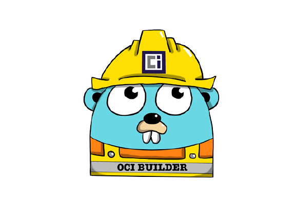

<br><br>

# oci-runtime

 Simple oci cli is a simple who implement [oci runtime lifecycle operations](https://github.com/opencontainers/runtime-spec/blob/main/runtime.md)


* [Installation](#installation)
* [Operations](#operations)
* [Usage](#usage)


## Installation

```shell
git clone git@github.com:chen-keinan/oci-runtime.git
```

```shell
go build 
```

## Usage
Create 2 folders bundles :
```shell
mkdir ~/bundles
mkdir ~/containers
```
Copy bundle file to `~/bundles` folder example:
```shell
cp redis.tgz ~/bundles/redis.tgz
```
## Operations
Create redis runtime (bundle must exist in bundle folder otherwise an error will be thrown)
```shell
./oci-runtime create <container id> <bundle name>
```
example:
```shell
/oci-runtime create 12345 redis
```
Start redis runtime (container must have created state otherwise an error will be thrown)
```shell
./oci-runtime start <container id> 
```
example:
```shell
/oci-runtime start 123456
```
List redis runtime
```shell
./oci-runtime state <container id> 
```
example:
```shell
/oci-runtime state 123456
```
```shell
ID  	STATUS 	BUNDLE	        PID        	VERSION
123456	created	redis 	5577006791947779410	    1.0
```

Stop redis runtime (container must have running state otherwise an error will be thrown)
```shell
./oci-runtime kill <container id> 
```
example:
```shell
/oci-runtime kill 123456
```
Delete redis runtime (container must have stopped state otherwise an error will be thrown)
```shell
./oci-runtime delete <container id> 
```
example:
```shell
/oci-runtime delete 123456
```
